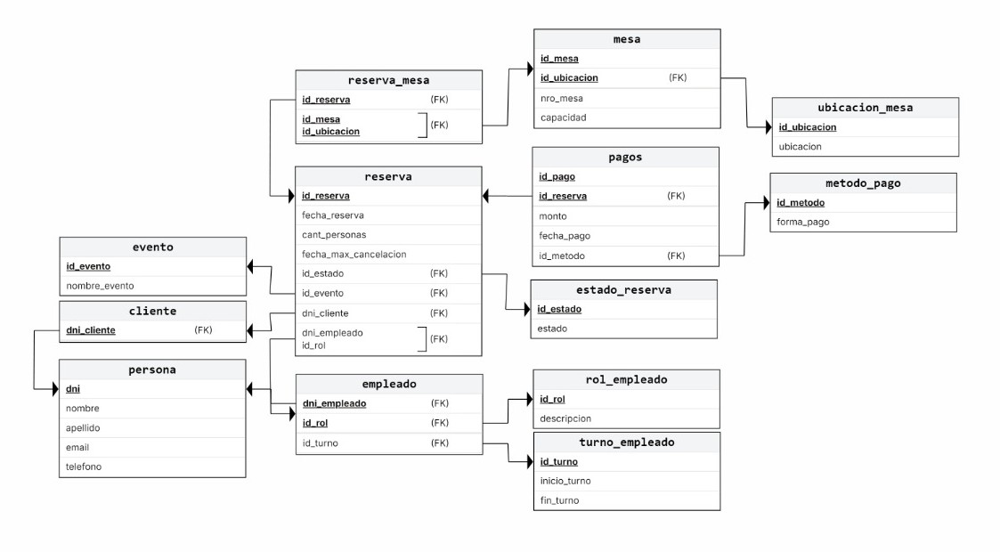

# UNIVERSIDAD NACIONAL DEL NORDESTE
**Facultad de Ciencias Exactas y Naturales y Agrimensura**  
**Cátedra: Base de Datos I**  
**Año: 2025**  
**Grupo: 25**

## Proyecto Base de Datos

### Alumnos:
- **Bys, Paz** - DNI: 46.242.480
- **Cardozo, Micaela** - DNI: 46.461.620
- **Cespedes, Hernan** - DNI: 42.739.764
- **Centurion Villamayor, Giovanni Isaias** - DNI: 96.079.673

---

# CAPÍTULO I
## Descripción del Trabajo

Nuestro proyecto consistirá en una base de datos enfocada a la administración y control de un bar/restaurante/local de comidas, la idea surge desde la experiencia de algunos alumnos del grupo que hemos podido trabajar en estos locales y presenciamos la precariedad de algunos de estos sistemas usados.

El objetivo general es realizar una base de datos para poder subsanar estos problemas y ofrecer un mejor manejo, consistencia y seguridad de datos a dichos emprendimientos.

Otros objetivos que queremos cumplir es poder ofrecer distintos tipos de perfiles para el manejo de la base de datos, cada uno con diferentes permisos, funciones y tipos de accesos. Mejorar la gestión de mesas, de clientes, de empleados y mejorar el registro de pagos.

## Alcance del Proyecto

El alcance del sistema está definido por las entidades y relaciones del esquema, cubriendo las siguientes áreas funcionales:

### 1. Gestión Integral de Reservas
- **Creación y Modificación**: Registrar y actualizar reservas asociadas a un Cliente (DNI, nombre, contacto) con fecha, hora y número de personas.
- **Asignación de Mesas**: Gestionar la asignación de una o varias Mesas a una reserva, considerando la capacidad y la UbicacionMesa (ej., terraza, salón).
- **Control de Estado**: Seguimiento del estado de la reserva a través de Estado_reserva (ej., confirmada, cancelada, completada).
- **Manejo de Cancelaciones**: Registro de las políticas o instancias de anulación en HorarioCancelacion.

### 2. Gestión de Mesas y Disponibilidad
- **Inventario**: Mantenimiento del catálogo de Mesas y sus características (número, capacidad).
- **Distribución**: Clasificación de mesas según su UbicacionMesa.
- **Disponibilidad en Tiempo Real**: Proveer información sobre qué mesas están libres u ocupadas en un momento dado, basándose en los registros de Reserva_Mesa.

### 3. Gestión de Clientes y Comunicación
- **Registro Central**: Almacenar datos básicos (Cliente).
- **Datos de Contacto**: Gestionar múltiples contactos por cliente (EmailCliente, TelefonoCliente).

### 4. Eventos y Promociones
- **Definición de Eventos**: Registro de EventosEspeciales (nombre, descripción).
- **Vinculación**: Asociación de reservas específicas con un evento mediante ReservaEvento.

### 5. Transacciones y Pagos
- **Registro de Pagos**: Documentación de cada pago realizado para una reserva (Pagos), incluyendo el monto y la fecha_pago.
- **Métodos de Pago**: Clasificación de las transacciones por MetodoPago (ej., tarjeta, efectivo).
- **Trazabilidad**: Identificación del Empleado responsable de procesar la transacción.

### 6. Gestión Básica de Personal y Turnos
- **Identificación**: Registro del Empleado (DNI, nombre).
- **Roles**: Asignación de funciones mediante RolEmpleado.
- **Horarios**: Planificación y registro de TurnoEmpleado (fecha, hora inicio/fin) para el personal.

## Exclusiones (Lo que NO está en el alcance)
- **Punto de Venta (POS)**: El sistema no abarca la gestión detallada de órdenes, menús, ingredientes, inventario de cocina o facturación fiscal compleja.
- **Nómina y Recursos Humanos**: No incluye el cálculo de sueldos, impuestos, vacaciones detalladas, o la gestión completa de RR.HH. del personal.
- **Marketing/Fidelización**: No incluye módulos avanzados de CRM, envío automatizado de correos de marketing o programas de lealtad.

---

# CAPÍTULO II
## ESTUDIO DE TRABAJO

## TEMA 01: PROCEDIMIENTOS Y FUNCIONES ALMACENADAS

## TEMA 02: TRANSACCIONES

## TEMA 03: OPTIMIZACIÓN DE ÍNDICES
# INTRODUCCION

En el ámbito de las bases de datos, crear índices eficaces es primordial para lograr un buen rendimiento de la base de datos, en especial si estamos tratando con grandes volúmenes de información. La ausencia de estos, la sobreindizacion o el mal diseño de los índices son los principales causantes de problemas de rendimiento de la base de datos.

Un índice en SQL funciona igual que un índice en un libro debido a que provee una forma rápida de localizar información en especifica en este mismo. La diferencia es que, en el ámbito de las bases de datos, los índices son una lista ordenada de valores acompañadas de sus punteros que, siendo redundante, apuntan a las paginas de datos donde se encuentran estos valores. Asi mismo los propios índices se almacenan en las denominadas paginas de índice.

Un índice es una estructura en disco o en memoria asociada a una tabla o vista que agiliza la recuperación de los registros de la tabla o vista. Un índice contiene claves creadas a partir de los valores de una o varias columnas de la tabla o vista. Almacenan los datos organizados de forma lógica como una tabla con filas y columnas, que a su vez son almacenados físicamente en un formato de datos de fila denominado almacén de filas

En este proyecto estaremos usando los índices agrupados o también conocidos como clustered pero también abordaremos de manera teorica y explicativa los non clustered.

## Índice Agrupado (Clustered Index)

**Organización física**: Este tipo de índice define y almacena el orden físico real de las filas de datos en el disco. Los datos de la tabla se ordenan y almacenan en el disco exactamente en la misma secuencia que el índice.

**Cantidad por tabla**: Solo puede existir un único índice agrupado por tabla, ya que es imposible que los datos estén físicamente ordenados de más de una manera a la vez.

**Analogía**: Es como ordenar un archivo de documentos por fecha de manera cronológica; los papeles mismos están físicamente en ese orden.

## Índice No Agrupado (Non-Clustered Index)

**Organización lógica**: Un índice no agrupado no altera el orden físico de los datos en la tabla. En su lugar, crea una estructura de datos independiente y separada de la tabla principal.

**Composición**: Esta estructura contiene una copia de las columnas indexadas (la clave del índice) junto con punteros o referencias que indican la ubicación física de cada fila de datos correspondiente en la tabla.

**Cantidad por tabla**: Puede haber múltiples índices no agrupados en una misma tabla.

**Analogía**: Funciona exactamente como el índice alfabético al final de un libro. El índice te dirige rápidamente a los números de página (los punteros) donde se encuentra la información, sin necesidad de que las páginas del libro estén reordenadas.
## TEMA 04: ÍNDICES COLUMNARES

### 1. Introducción y Conceptos Fundamentales 
Un **Índice Columnar (Columnstore Index)** es una tecnología de almacenamiento y procesamiento de datos que organiza los datos a nivel de columna en lugar de a nivel de fila. El objetivo principal de este formato es optimizar las consultas analíticas (scans masivos) en grandes conjuntos de datos, especialmente en entornos de Data Warehousing  (Almacenamiento de Datos).

En cambio, la forma tradicional en cómo se almacenan los datos se denominan **Rowstore**, que es básicamente almacenar físicamente los datos en filas.

En un **Rowgroup** (grupo de filas, forma tradicional), las filas son comprimidas al mismo tiempo con el formato del almacén de columnas. Por el contrario, el almacén de columnas segmenta la tabla en grupos de filas para luego comprimir cada uno de ellos a modo columna.

Para mejorar el rendimiento y reducir la fragmentación de los segmentos, el índice columnar puede almacenar temporalmente algunos datos en un almacén denominado Delta. Este almacén es un grupo de filas Delta que usan índice de árbol B agrupado, teniendo mejoras en cuanto a rendimiento y compresión debido a la utilización de almacenamiento de filas hasta alcanzar 1.048.576 filas para luego moverlas al almacén de columnas.

### 2. Diferencias con los Índices Tradicionales (Rowstore)
La principal distinción es la organización y el enfoque:

| Aspectos | Columnar (Columnstore) | Tradicional (Rowstore) |
|----------|------------------------|-------------------------|
| Organización Física | Los valores de la misma columna se almacenan juntos. | Los valores de una fila completa se almacenan juntos. |
| Optimización | Consultas analíticas, agregaciones y reportes. | Transacciones (OLTP) y búsquedas por clave. 
| Rendimiento Analítico | Utiliza la Ejecución en Modo por Lotes (Batch Mode) para procesar miles de filas a la vez. | Procesa datos fila por fila (Row Mode), más lento para grandes volúmenes. |
| Compresión | Extrema, ya que los valores de una misma columna suelen ser muy similares. | Moderada o estándar (menos eficiente para análisis). |

### 3. Principal Caso de Uso
#### Escenario Principal
- El beneficio máximo se obtiene cuando se necesita analizar grandes volúmenes de datos mediante scans masivos para realizar agregaciones, reportes complejos, o análisis de tendencias.
- Esto se debe a las características únicas del índice columnar:
- Alto Rendimiento en Consultas Analíticas: Proporcionan hasta 10 veces el rendimiento en comparación con el almacenamiento tradicional orientado a filas, gracias a la Ejecución en Modo por Lotes que procesa múltiples filas a la vez.
- Compresión Masiva de Datos: Logran hasta 10 veces más compresión de datos. Esto minimiza la E/S (Input/Output) necesaria para leer la información del disco.

#### Escenarios Secundarios (Análisis Operativo)
- Un caso de uso secundario, pero muy importante, es el análisis operativo en tiempo real.
- Al usar un índice columnar no agrupado sobre una tabla tradicional (Rowstore), se permite que:
  - * La carga de trabajo transaccional (OLTP) utiliza el índice de fila subyacente.
  - * Las consultas analíticas de alto rendimiento utilizan simultáneamente el índice columnar.
- Esto elimina la necesidad de mover los datos a un sistema separado para el análisis.

### 4. Tipos de Índices Columnares
Existen dos implementaciones principales, diseñadas para diferentes escenarios:
- **Agrupado (Clustered Columnstore Index):**
- 1. Es el almacenamiento primario de la tabla, lo que significa que toda la tabla se almacena en formato columnar.
- 2. Ideal para tablas de hechos en Data Warehouses donde el análisis es la única prioridad.

- **No Agrupado (Nonclustered Columnstore Index):**
- 1. Es un índice secundario creado sobre una tabla tradicional (Rowstore). Esto permite el Análisis Operativo en Tiempo Real, donde las transacciones OLTP usan la tabla Rowstore subyacente y las consultas analíticas usan el índice Columnar de alto rendimiento de forma simultánea.
- 2. Las inserciones pequeñas se gestionan inicialmente en el Deltastore (que usa un índice de árbol B), un almacén temporal que es eficiente para transacciones. Estas filas son luego movidas y comprimidas al almacén de columnas una vez que alcanzan un tamaño suficiente.

### 5. Beneficios Principales
- **Alto Rendimiento Analítico:** Ofrece hasta 10 veces más velocidad en consultas analíticas que examinan grandes cantidades de datos.
- **Alta Compresión:** Logra hasta 10 veces más compresión de datos que el almacenamiento sin comprimir, reduciendo costos de almacenamiento y E/S (Input/Output).
- **Eficiencia de Recursos:** La alta compresión reduce la superficie de memoria necesaria, permitiendo a SQL Server ejecutar más consultas y operaciones en memoria.
- **Análisis en Tiempo Real:** Permite realizar análisis de alto rendimiento directamente sobre las cargas de trabajo transaccionales activas sin necesidad de mover los datos a un Data Warehouse separado (usando el índice no agrupado).

# CAPÍTULO IV
## MODELO RELACIONAL

> Modelo Relacional: 

## Diccionario De Datos

### Tabla: Cliente
| Columna | Tipo de Dato | PK/FK | Relación (FK Referencia) | Descripción |
|---------|-------------|--------|-------------------------|-------------|
| DNI | VARCHAR(15) | PK | N/A | Documento Nacional de Identidad del cliente. Identificador único. |
| nombre | VARCHAR(100) | | N/A | Nombre del cliente. |
| apellido | VARCHAR(100) | | N/A | Apellido del cliente. |
| email | VARCHAR(100) | | N/A | Email del cliente. |

### Tabla: TelefonoCliente
| Columna | Tipo de Dato | PK/FK | Relación (FK Referencia) | Descripción |
|---------|-------------|--------|-------------------------|-------------|
| DNI | VARCHAR(15) | FK | Cliente (DNI) | DNI del cliente asociado. |
| telefono | VARCHAR(20) | PK | N/A | Número de teléfono del cliente. |

### Tabla: Estado_reserva
| Columna | Tipo de Dato | PK/FK | Relación (FK Referencia) | Descripción |
|---------|-------------|--------|-------------------------|-------------|
| ID_estado | INT | PK | N/A | Identificador único del estado (ej: Confirmada, Cancelada). |
| estado | VARCHAR(50) | | N/A | Nombre descriptivo del estado. |

### Tabla: Reserva
| Columna | Tipo de Dato | PK/FK | Relación (FK Referencia) | Descripción |
|---------|-------------|--------|-------------------------|-------------|
| ID_reserva | INT | PK | N/A | Identificador único de la reserva. |
| fecha_reserva | DATE | | N/A | Fecha programada para la reserva. |
| hora_reserva | TIME | | N/A | Hora programada para la reserva. |
| cant_personas | INT | | N/A | Cantidad de personas de la reserva. |
| DNI | VARCHAR(15) | FK | Cliente (DNI) | DNI del cliente que realiza la reserva. |
| ID_estado | INT | FK | Estado_reserva (ID_estado) | Estado actual de la reserva. |
| ID_turno | INT | FK | TurnoEmpleado (ID_turno) | Turno de empleado asociado a la gestión de esta reserva (puede ser el que la registró). |
| DNI_empleado | VARCHAR(15) | FK | Empleado (DNI_empleado) | Empleado que registró o gestionó la reserva. |

### Tabla: HorarioCancelacion
| Columna | Tipo de Dato | PK/FK | Relación (FK Referencia) | Descripción |
|---------|-------------|--------|-------------------------|-------------|
| ID_cancelacion | INT | PK | N/A | Identificador único del registro de cancelación. |
| ID_reserva | INT | FK | Reserva (ID_reserva) | Reserva que fue cancelada. |
| motivo | VARCHAR(255) | | N/A | Razón de la cancelación. |
| fecha_cancelacion | DATE | | N/A | Fecha en que se registró la cancelación. |
| hora_cancelacion | TIME | | N/A | Hora en que se registró la cancelación. |

### Tabla: UbicacionMesa
| Columna | Tipo de Dato | PK/FK | Relación (FK Referencia) | Descripción |
|---------|-------------|--------|-------------------------|-------------|
| ID_ubicacion | INT | PK | N/A | Identificador único de la zona o área del restaurante. |
| ubicacion | VARCHAR(100) | | N/A | Nombre de la ubicación (ej: "Terraza", "Salón"). |

### Tabla: Mesa
| Columna | Tipo de Dato | PK/FK | Relación (FK Referencia) | Descripción |
|---------|-------------|--------|-------------------------|-------------|
| ID_mesa | INT | PK | N/A | Identificador único interno de la mesa. |
| nro_mesa | INT | | N/A | Número visible o identificador físico de la mesa. |
| capacidad | INT | | N/A | Máxima capacidad de personas de la mesa. |
| ID_ubicacion | INT | FK | UbicacionMesa (ID_ubicacion) | Ubicación física de la mesa. |

### Tabla: Reserva_Mesa
| Columna | Tipo de Dato | PK/FK | Relación (FK Referencia) | Descripción |
|---------|-------------|--------|-------------------------|-------------|
| ID_reserva | INT | PK, FK | Reserva (ID_reserva) | Reserva a la que se asigna la mesa. |
| ID_mesa | INT | PK, FK | Mesa (ID_mesa) | Mesa asignada a la reserva. |
| nro_dia | INT | | N/A | (Uso alternativo) Número de día de la semana. |
| inicio_dispo | TIME | | N/A | Hora de inicio de la ocupación/disponibilidad para la reserva. |
| fin_dispo | TIME | | N/A | Hora de fin de la ocupación/disponibilidad para la reserva. |
| fecha_dispo | DATE | | N/A | Fecha específica de la asignación. |

### Tabla: RolEmpleado
| Columna | Tipo de Dato | PK/FK | Relación (FK Referencia) | Descripción |
|---------|-------------|--------|-------------------------|-------------|
| ID_rol | INT | PK | N/A | Identificador único del rol (ej: Mesero, Gerente). |
| nombre_rol | VARCHAR(100) | | N/A | Nombre descriptivo del rol del empleado. |

### Tabla: Empleado
| Columna | Tipo de Dato | PK/FK | Relación (FK Referencia) | Descripción |
|---------|-------------|--------|-------------------------|-------------|
| DNI_empleado | VARCHAR(15) | PK | N/A | DNI del empleado. Identificador único. |
| nombre | VARCHAR(100) | | N/A | Nombre del empleado. |
| apellido | VARCHAR(100) | | N/A | Apellido del empleado. |
| ID_rol | INT | FK | RolEmpleado (ID_rol) | Rol asignado al empleado. |

### Tabla: TurnoEmpleado
| Columna | Tipo de Dato | PK/FK | Relación (FK Referencia) | Descripción |
|---------|-------------|--------|-------------------------|-------------|
| ID_turno | INT | PK | N/A | Identificador único del turno programado. |
| DNI_empleado | VARCHAR(15) | FK | Empleado (DNI_empleado) | Empleado asignado a este turno. |
| fecha_turno | DATE | | N/A | Fecha del turno de trabajo. |
| inicio_turno | TIME | | N/A | Hora de inicio de la jornada. |
| fin_turno | TIME | | N/A | Hora de fin de la jornada. |
| hr_turno | TIME | | N/A | Duración del turno (horas). |

### Tabla: MetodoPago
| Columna | Tipo de Dato | PK/FK | Relación (FK Referencia) | Descripción |
|---------|-------------|--------|-------------------------|-------------|
| ID_metodo | INT | PK | N/A | Identificador único del tipo de pago. |
| nombre_pago | VARCHAR(50) | | N/A | Nombre del método (ej: Efectivo, Tarjeta). |

### Tabla: Pagos
| Columna | Tipo de Dato | PK/FK | Relación (FK Referencia) | Descripción |
|---------|-------------|--------|-------------------------|-------------|
| ID_pago | INT | PK | N/A | Identificador único de la transacción de pago. |
| ID_reserva | INT | FK | Reserva (ID_reserva) | Reserva a la que está asociado el pago. |
| monto | DECIMAL(10,2) | | N/A | Monto total del pago realizado. |
| fecha_pago | DATE | | N/A | Fecha en que se realizó el pago. |
| ID_metodo | INT | FK | MetodoPago (ID_metodo) | Método de pago utilizado. |
| ID_empleado | VARCHAR(15) | FK | Empleado (DNI_empleado) | Empleado que procesó el pago. |

### Tabla: EventoEspecial
| Columna | Tipo de Dato | PK/FK | Relación (FK Referencia) | Descripción |
|---------|-------------|--------|-------------------------|-------------|
| ID_evento | INT | PK | N/A | Identificador único del evento especial. |
| nombre_evento | VARCHAR(100) | | N/A | Nombre del evento (ej: Navidad, Catering corporativo). |
| description | VARCHAR(255) | | N/A | Descripción detallada del evento. |

### Tabla: ReservaEvento
| Columna | Tipo de Dato | PK/FK | Relación (FK Referencia) | Descripción |
|---------|-------------|--------|-------------------------|-------------|
| ID_reserva | INT | PK, FK | Reserva (ID_reserva) | Reserva asociada al evento especial. |
| ID_evento | INT | PK, FK | EventoEspecial (ID_evento) | Evento especial al que corresponde la reserva. |

# CAPÍTULO V
## CONCLUSIÓN
