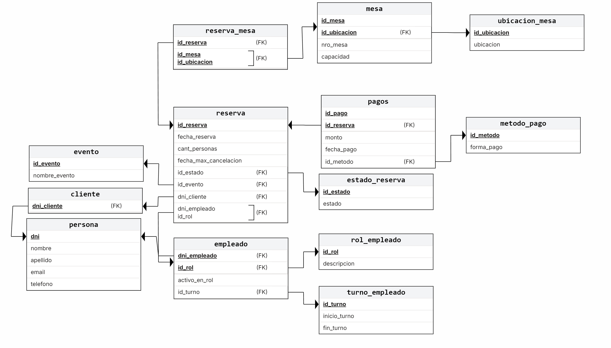

# UNIVERSIDAD NACIONAL DEL NORDESTE
**Facultad de Ciencias Exactas y Naturales y Agrimensura**  
**Cátedra: Base de Datos I**  
**Año: 2025**  
**Grupo: 25**

## Proyecto Base de Datos
## Proyecto Restaurant 2025

### Alumnos:
- **Bys, Paz** - DNI: 46.242.480
- **Cardozo, Micaela** - DNI: 46.461.620
- **Cespedes, Hernan** - DNI: 42.739.764
- **Centurion Villamayor, Giovanni Isaias** - DNI: 96.079.673

---

# CAPÍTULO I
## Descripción del Trabajo

Nuestro proyecto consistirá en una base de datos enfocada a la administración y control de un bar/restaurante/local de comidas, la idea surge desde la experiencia de algunos alumnos del grupo que hemos podido trabajar en estos locales y presenciamos la precariedad de algunos de estos sistemas usados.

El objetivo general es realizar una base de datos para poder subsanar estos problemas y ofrecer un mejor manejo, consistencia y seguridad de datos a dichos emprendimientos.

Otros objetivos que queremos cumplir es poder ofrecer distintos tipos de perfiles para el manejo de la base de datos, cada uno con diferentes permisos, funciones y tipos de accesos. Mejorar la gestión de mesas, de clientes, de empleados y mejorar el registro de pagos.

## Alcance del Proyecto

El alcance del sistema está definido por las entidades y relaciones del esquema, cubriendo las siguientes áreas funcionales:

### 1. Gestión Integral de Reservas
- **Creación y Modificación**: Registrar y actualizar reservas asociadas a un Cliente (DNI, nombre, contacto) con fecha, hora y número de personas.
- **Asignación de Mesas**: Gestionar la asignación de una o varias Mesas a una reserva, considerando la capacidad y la UbicacionMesa (ej., terraza, salón).
- **Control de Estado**: Seguimiento del estado de la reserva a través de Estado_reserva (ej., confirmada, cancelada, completada).
- **Manejo de Cancelaciones**: Registro de las políticas o instancias de anulación en HorarioCancelacion.

### 2. Gestión de Mesas y Disponibilidad
- **Inventario**: Mantenimiento del catálogo de Mesas y sus características (número, capacidad).
- **Distribución**: Clasificación de mesas según su UbicacionMesa.
- **Disponibilidad en Tiempo Real**: Proveer información sobre qué mesas están libres u ocupadas en un momento dado, basándose en los registros de Reserva_Mesa.

### 3. Gestión de Clientes y Comunicación
- **Registro Central**: Almacenar datos básicos (Cliente).
- **Datos de Contacto**: Gestionar múltiples contactos por cliente (EmailCliente, TelefonoCliente).

### 4. Eventos y Promociones
- **Definición de Eventos**: Registro de EventosEspeciales (nombre, descripción).
- **Vinculación**: Asociación de reservas específicas con un evento mediante ReservaEvento.

### 5. Transacciones y Pagos
- **Registro de Pagos**: Documentación de cada pago realizado para una reserva (Pagos), incluyendo el monto y la fecha_pago.
- **Métodos de Pago**: Clasificación de las transacciones por MetodoPago (ej., tarjeta, efectivo).
- **Trazabilidad**: Identificación del Empleado responsable de procesar la transacción.

### 6. Gestión Básica de Personal y Turnos
- **Identificación**: Registro del Empleado (DNI, nombre).
- **Roles**: Asignación de funciones mediante RolEmpleado.
- **Horarios**: Planificación y registro de TurnoEmpleado (fecha, hora inicio/fin) para el personal.

## Exclusiones (Lo que NO está en el alcance)
- **Punto de Venta (POS)**: El sistema no abarca la gestión detallada de órdenes, menús, ingredientes, inventario de cocina o facturación fiscal compleja.
- **Nómina y Recursos Humanos**: No incluye el cálculo de sueldos, impuestos, vacaciones detalladas, o la gestión completa de RR.HH. del personal.
- **Marketing/Fidelización**: No incluye módulos avanzados de CRM, envío automatizado de correos de marketing o programas de lealtad.

---

# CAPÍTULO II
## ESTUDIO DE TRABAJO
En este proyecto de estudio para el Proyecto Restaurant 2025, hemos diseñado e implementado una solución de base de datos integral que abarca desde la estructura relacional hasta la optimización avanzada. Comenzamos definiendo un esquema robusto (db_proyecto.sql) con restricciones de integridad referencial y reglas de negocio estrictas para entidades clave como persona, reserva y empleado. Para asegurar la fiabilidad operativa, desarrollamos un módulo transaccional (trasaction.sql) que gestiona procesos críticos, como la creación de reservas validando disponibilidad de mesas y horarios, los pagos y la asignación de roles, implementando bloques TRY/CATCH para garantizar la atomicidad y el manejo de errores. Asi mismo, modularizamos la lógica repetitiva mediante procedimientos almacenados para el mantenimiento de datos y funciones escalares para cálculos de negocio. Finalmente, nos hemos enfocado en el rendimiento: realizamos pruebas de estrés comparando tiempos de respuesta con y sin índices agrupados tradicionales, y exploramos tecnologías OLAP implementando índices columnares (Columnstore) en una tabla espejo, lo que nos permitió contrastar métricas de desempeño entre el almacenamiento por filas y por columnas para consultas de agregación masiva.

## TEMA 01: PROCEDIMIENTOS Y FUNCIONES ALMACENADAS

### 1. Introduccion y Beneficios: 
Un Procedimiento Almacenado (SP) en SQL Server es un objeto de base de datos que agrupa una o más instrucciones Transact-SQL (el lenguaje de SQL Server) 
en un solo plan de ejecución. También puede ser una referencia a un método CLR de .NET Framework.

Se asemejan a las construcciones de otros lenguajes de programación, ya que están diseñados para:
  - Aceptar parámetros de entrada (ej: @dni) y devolver múltiples valores en forma de parámetros de salida (ej: @id_creado).
  - Contener lógica de programación que realice operaciones complejas en la base de datos, incluyendo la llamada a otros procedimientos.
  - Devolver un valor de estado a la aplicación que lo llamó, para indicar si la operación tuvo éxito o si se produjo un error (y por qué).

#### Beneficios (Eficiencia y Seguridad)
- **Rendimiento y Reducción de Tráfico:** Las operaciones se ejecutan como un solo lote. Esto reduce el tráfico de red, ya que la aplicación solo envía
  una llamada EXEC en lugar de múltiples líneas de código SQL. El plan de ejecución se guarda en caché, acelerando ejecuciones futuras.
- **Seguridad (Encapsulación):** Permiten conceder permiso a un usuario para ejecutar el procedimiento (ej: GRANT EXECUTE ON sp_InsertarPersona) sin darle
  permiso directo para escribir (INSERT) en las tablas. Esto previene ataques de inyección SQL.
- **Mantenimiento (Reutilización):** Encapsulan la lógica de negocio. Si la regla para insertar un registro cambia, solo se modifica el SP, y no todas las
  aplicaciones que lo consumen.

### 2. Gestión y Ciclo de Vida de un Procedimiento Almacenado

Basado en la documentación de Microsoft, el ciclo de vida y la gestión de un procedimiento almacenado (SP) cubre las siguientes tareas:
  - **Creación de un procedimiento almacenado:** Es el proceso inicial donde se define el SP por primera vez. Se utiliza el comando CREATE PROCEDURE.
    Aquí se establece su nombre, los parámetros que recibirá y las instrucciones T-SQL que ejecutará.
  - **Modificar un procedimiento almacenado:** Se refiere a la actualización de un SP que ya existe. Se utiliza el comando ALTER PROCEDURE. Esto permite
    cambiar la lógica interna, añadir o quitar parámetros sin tener que borrarlo y volverlo a crear.
  - **Eliminación de un procedimiento almacenado:** Es el proceso de borrar permanentemente el SP de la base de datos. Se utiliza el comando DROP PROCEDURE.
  - **Ejecución de un procedimiento almacenado:** Es la acción de "llamar" o invocar al SP para que realice su tarea. Se utiliza el comando EXECUTE
    (o su abreviatura EXEC) seguido del nombre del SP y sus parámetros.
  - **Conceder permisos para un procedimiento almacenado:** Se refiere a la gestión de la seguridad. Es el acto de dar permiso (GRANT) a un usuario o rol
    para que pueda ejecutar un SP, sin necesidad de darle permisos directos sobre las tablas que este modifica.
  - **Devolución de datos de un procedimiento almacenado:** Describe las diferentes formas en que un SP puede devolver información a la aplicación que lo llamó.
    Esto puede ser a través de un conjunto de resultados (un SELECT), un parámetro de salida (OUTPUT) o un valor de estado (un número que indica éxito o error).
  - **Volver a compilar un procedimiento almacenado:** Es una tarea de optimización. Cuando un SP se ejecuta por primera vez, SQL Server crea un "plan de ejecución" y lo guarda.
    Recompilarlo (sp_recompile) fuerza al sistema a crear un nuevo plan, lo cual es útil si las tablas han cambiado mucho y el plan antiguo ya no es eficiente.
  - **Cambiar el nombre de un procedimiento almacenado:** Es el comando (sp_rename) que se utiliza para cambiar el nombre de un SP existente.
  - **Visualización de la definición de un procedimiento almacenado:** Es la forma de ver el código fuente (las instrucciones T-SQL) de un SP que ya está creado,
    usualmente usando el comando sp_helptext.
  - **Ver las dependencias de un procedimiento almacenado:** Permite analizar qué objetos (como tablas o vistas) utiliza el SP, o qué otros procedimientos llaman a este SP.
    Es fundamental para el mantenimiento, para saber que si se modifica una tabla, no se "romperá" un SP. 

### 3. Tipos de Procedimientos Almacenados

#### 1. Definidos por el Usuario (User-defined)
Estos son los procedimientos estándar que los desarrolladores crean y almacenan dentro de una base de datos específica (definida por el usuario). Son el tipo 
principal que usarás en tu proyecto. Pueden ser escritos en Transact-SQL o hacer referencia a un método CLR (.NET Framework).

        Ejemplo (T-SQL)
        -- El procedimiento que estamos creando para el proyecto
        CREATE PROCEDURE sp_InsertarPersona
            @dni INT,
            @nombre VARCHAR(100)
        AS
        BEGIN
            INSERT INTO persona (dni, nombre)
            VALUES (@dni, @nombre);
        END
#### 2. Temporales (Temporary)
Son una forma especial de procedimientos definidos por el usuario, pero se almacenan en la base de datos temporal (tempdb) en lugar de en la tuya. Se eliminan automáticamente
  - **Temporal Local (#):**
    El nombre comienza con un solo #.
    Solo es visible para la conexión del usuario que lo creó.
    Se elimina automáticamente cuando ese usuario cierra la conexión.
    Ejemplo: CREATE PROC #MiReporteTemporal ...

  - **Temporal Global (##):**
    El nombre comienza con dos ##.
    Es visible para cualquier usuario después de su creación.
    Se elimina cuando la última sesión que lo estaba usando se cierra.
    Ejemplo: CREATE PROC ##ConfiguracionGlobal ...

#### 3. del Sistema (System)
Estos son los procedimientos preinstalados que vienen con el Motor de Base de Datos. SQL Server los usa para administrar y reportar sobre el estado del sistema.
  - Están almacenados en la base de datos Resource pero aparecen lógicamente en el esquema sys de todas las bases de datos.
  - Comienzan con el prefijo sp_. (Se recomienda no usar sp_ para tus propios procedimientos).

         Ejemplo:

        -- Muestra información sobre el objeto 'persona'
  
        EXEC sp_help 'persona';
  
        -- Muestra las conexiones activas en el servidor
        EXEC sp_who;

#### 4. Extendidos Definidos por el Usuario (Extended)
Estos procedimientos permiten a SQL Server ejecutar rutinas externas escritas en lenguajes como C. Son bibliotecas DLL que el servidor carga y ejecuta dinámicamente.
  - **Usan el prefijo xp_:** 

        -- (A menudo deshabilitado por seguridad)

        -- Ejecuta un comando en el sistema operativo del servidor
        EXEC xp_cmdshell 'DIR C:';

### 3. Funciones Definidas por el Usuario (UDF)
Una función es una rutina que acepta parámetros, realiza una acción (generalmente un cálculo) y siempre debe devolver un valor.

#### Tipos Principales
  - **Funciones Escalares:** Devuelven un único valor (ej: un número, texto o fecha). Son ideales para cálculos repetitivos.
      Ejemplo: fn_CalcularEdad(@fecha_nacimiento)
  - **Funciones con Valores de Tabla (TVF):** Devuelven una tabla completa (un conjunto de resultados). Son como "vistas con parámetros".
      Ejemplo: fn_ReservasDelCliente(@dni)
#### Uso Principal
  La gran ventaja de las funciones es que se pueden usar directamente dentro de un SELECT o WHERE, algo que los procedimientos no pueden hacer.
         
      Ejemplo SQL
      -- Se usa como una columna más
      SELECT
          nombre,
          dbo.fn_CalcularEdad(fecha_nacimiento) AS Edad
      FROM
          persona;

### 4. Aplicación en Operaciones CRUD
Como vimos en la lista anterior, las tareas fundamentales son Crear, Modificar y Eliminar. A continuación, aplicaremos estos conceptos para implementar 
las operaciones CRUD (Crear, Leer, Modificar, Borrar) en nuestro proyecto.

Los procedimientos almacenados son el mecanismo ideal para encapsular y centralizar esta lógica de negocio. Actúan como una "API" segura para la base de datos.
  - **Crear (INSERT):** Se implementa un procedimiento (ej: sp_InsertarPersona) que recibe todos los campos de la nueva fila como parámetros. Esto asegura que
    solo se inserten datos válidos y de la forma correcta, ocultando la lógica del INSERT a la aplicación.
  - **Modificar (UPDATE):** Se diseña un procedimiento (ej: sp_ModificarPersona) que recibe la clave primaria (ej: @dni) para identificar el registro, junto con
    los nuevos valores que se deben actualizar
  - **Borrar (DELETE):** Se crea un procedimiento (ej: sp_BorrarPersona) que solo acepta la clave primaria (@dni). Esto previene eliminaciones accidentales o
    maliciosas y permite añadir lógica de borrado (como un borrado lógico) en un futuro.
  - **Leer (SELECT):** Aunque a menudo se hacen con vistas o funciones, los SPs también son potentes para devolver conjuntos de resultados complejos, permitiendo
    filtros y lógica que una vista simple no puede manejar.

#### Capacidades Avanzadas (Integridad y Errores)
Más allá del CRUD básico, la verdadera potencia de los procedimientos almacenados radica en su capacidad para:
  - **Manejar Transacciones:** Agrupar múltiples comandos (ej: un INSERT en pagos y un UPDATE en reserva) en una sola unidad de trabajo "todo o nada". Si una parte
    falla, todo se revierte (ROLLBACK), garantizando la integridad de los datos.
  - **Gestión Compleja de Errores:** Implementar bloques TRY...CATCH para capturar errores de SQL durante la ejecución. Esto permite devolver mensajes de error claros
    y personalizados a la aplicación, en lugar de mensajes crípticos del sistema.

### 5. Diferencias Clave (Procedimiento vs. Función)

| Característica | Procedimiento Almacenado (SP) |  Función (UDF)  |
|----------------|-------------------------------|-----------------|
| Propósito Principal | Ejecutar acciones (modificar datos, gestionar procesos). | Realizar cálculos y devolver un valor. | 
| Valor de Retorno | No es obligatorio. Puede devolver 0 o más conjuntos de resultados. | Obligatorio. Debe devolver un solo valor (escalar o tabla). | 
| Modificar Datos (CRUD) | Sí. Es su uso ideal (INSERT, UPDATE, DELETE). | No. No pueden "realizar acciones que modifiquen el estado de la base de datos". | 
| Cómo se llama | Con EXECUTE o EXEC. | Directamente en un SELECT o WHERE. | 
| Uso en SELECT | No se puede llamar dentro de un SELECT. | Sí. Es su principal ventaja. | 
| Manejo de Errores | Soporta TRY...CATCH y transacciones completas | Limitado. No soporta TRY...CATCH. | 
| Llamadas | Puede llamar a funciones. | No puede llamar a procedimientos almacenados. | 

## TEMA 02: TRANSACCIONES
## Introducción
***
El sistema de gestión de bases de datos (**DBMS**) **SQL Server** está diseñado para albergar datos críticos en entornos empresariales, donde la **precisión** y la **confiabilidad** son imperativas. Dentro de esta arquitectura, el concepto de **transacción** no es meramente una funcionalidad, sino el mecanismo fundamental que garantiza la **integridad de los datos**.

Esta investigación se centra en los cimientos teóricos (**ACID**), la implementación práctica en **Transact-SQL (T-SQL)** y los desafíos avanzados de **concurrencia** y **resiliencia** que enfrentan los arquitectos y desarrolladores.

***
## Fundamentos de la Gestión Transaccional y el Modelo ACID

SQL Server es un sistema diseñado para albergar datos críticos donde la precisión y la confiabilidad son fundamentales. El concepto de transacción es el mecanismo principal para garantizar la integridad de los datos. Una transacción es una secuencia de operaciones ejecutadas como una **única unidad lógica de trabajo** ("todo o nada"). Su propósito crítico es mantener la **coherencia operativa** y la **consistencia** de los datos. Si una operación compleja falla, el sistema debe revertir todos los cambios (**rollback**) para evitar un estado inconsistente.

### El Modelo Teórico: Propiedades ACID
Para que cualquier base de datos relacional sea confiable, debe adherirse a los principios **ACID** (**Atomicidad**, **Consistencia**, **Aislamiento**, **Durabilidad**), que SQL Server sigue por defecto.

| Propiedad (ACID) | Definición Operacional | Mecanismo Central en SQL Server |
| :--- | :--- | :--- |
| **Atomicidad (A)** | Garantía de "Todo o Nada". | `ROLLBACK TRANSACTION` y el Motor de Recuperación (Log). |
| **Consistencia (C)** | Transición de estado válido a otro, respetando reglas. | Restricciones de Integridad (FKs, Checks) y Lógica de Negocio. |
| **Aislamiento (I)** | Transacciones concurrentes invisibles entre sí. | Niveles de Aislamiento y Mecanismos de Bloqueo/Versionamiento. |
| **Durabilidad (D)** | Cambios permanentes después del `COMMIT`, persistiendo a fallos. | Registro de Transacciones (**WAL**) y subsistema de almacenamiento. |

***
## El Desafío de la Durabilidad y la Implementación en T-SQL

### El Impacto Crítico de la Durabilidad
La **Durabilidad** se logra mediante el principio de **Write-Ahead Logging (WAL)**: la transacción se escribe en el **Log de Transacciones** antes de que los cambios se apliquen a los archivos de datos.

La arquitectura del Log es crucial para el rendimiento. La proliferación de **Archivos de Registro Virtuales (VLFs)**, causada por un crecimiento automático (`FILEGROWTH`) frecuente, prolonga el tiempo de recuperación (**RTO**) y causa problemas de rendimiento. Un evento de crecimiento de archivo puede causar tipos de espera severos (`ASYNC_IO_COMPLETION`).

> **Requisito Arquitectónico**: Pre-asignar el archivo de Log a su tamaño máximo y usar incrementos fijos grandes para limitar los VLFs y garantizar el rendimiento.

### Implementación Práctica en T-SQL
Aunque SQL Server opera por defecto en modo **autocommit**, los procesos complejos requieren transacciones explícitas.

* **Estructura Base**:
    1.  Inicio: `BEGIN { TRAN | TRANSACTION }`
    2.  Finalización Exitosa: `COMMIT { TRAN | TRANSACTION }`
    3.  Reversión Total: `ROLLBACK { TRAN | TRANSACTION }`
* **Funcionalidades Avanzadas**:
    * **Puntos de Guardado** (`SAVE TRANSACTION`): Permiten la reversión parcial dentro de una transacción principal.
    * **Transacciones Marcadas** (`WITH MARK`): Herramienta crítica para la **Recuperación ante Desastres (DR)**, permitiendo restaurar a un punto consistente específico.
* **Optimización Estratégica**: Las transacciones deben ser lo más **cortas y concisas** posible, minimizando el tiempo que se mantienen los bloqueos y evitando contención.

***
## Control de Concurrencia: Niveles de Aislamiento

### El Desafío del Aislamiento (I)
El **Aislamiento** busca equilibrar la consistencia de los datos con el rendimiento del sistema en un entorno multiusuario.

Los **fallos de concurrencia** que los niveles de aislamiento buscan evitar son:
* **Lecturas Sucias** (*Dirty Reads*): Leer datos modificados por otra transacción que aún no ha hecho `COMMIT`.
* **Lecturas No Repetibles** (*Non-repeatable Reads*): Obtener resultados diferentes en la misma lectura porque otra transacción modificó y confirmó datos entre las lecturas.
* **Fantasmas** (*Phantom Reads*): Aparición o desaparición de filas completas en un conjunto de resultados debido a inserciones/eliminaciones concurrentes.

### Niveles de Aislamiento Estándar (Basados en Bloqueo)
Los niveles, configurables con `SET TRANSACTION ISOLATION LEVEL`, usan bloqueos compartidos (**S-locks**) en las lecturas.

| Nivel de Aislamiento | Lecturas Sucias | Lecturas No Repetibles | Fantasmas | Riesgo/Ventaja |
| :--- | :--- | :--- | :--- | :--- |
| **Read Uncommitted** | Permitido | Permitido | Permitido | Máxima concurrencia, datos no fiables. |
| **Read Committed (RC)** | Evitado | Permitido | Permitido | **Nivel por defecto**. Evita el problema más grave. |
| **Repeatable Read** | Evitado | Evitado | Permitido | Bloquea filas leídas. |
| **Serializable** | Evitado | Evitado | Evitado | Máximo aislamiento. Menor concurrencia. |

Para transacciones críticas que dependen de la validación de un conjunto de datos, el nivel debe ser elevado (a `REPEATABLE READ` o `SERIALIZABLE`).

***
## El Modelo de Versionamiento de Filas y Gestión de Deadlocks

### El Aislamiento Basado en Versiones de Fila (Row Versioning)
Es una alternativa superior al bloqueo que evita los tres problemas de concurrencia sin que las lecturas tomen bloqueos compartidos. Utiliza una **versión de los datos** (almacenada en `TempDB`) tal como existían al inicio de la transacción/sentencia.

* **Niveles Clave**: `SNAPSHOT` y `READ COMMITTED SNAPSHOT ISOLATION (RCSI)`.
* **Ventaja Estratégica**: Reduce drásticamente la contención entre lectores y escritores, mitigando una fuente principal de **deadlocks Lector-Escritor** y mejorando la escalabilidad.

### Bloqueo vs. Deadlock
* **Bloqueo (*Blocking*)**: Comportamiento normal donde una sesión espera pasivamente a que otra libere un recurso.
* **Deadlock (*Bloqueo Mutuo*)**: Condición de **espera circular** donde dos o más transacciones se bloquean mutuamente.

### Tipología y Resolución de Deadlocks
* **Deadlocks Lector-Escritor**: Entre un `SELECT` y un `UPDATE`/`DELETE`. Mitigado con **RCSI**.
* **Deadlocks Escritor-Escritor**: Entre transacciones que compiten por bloqueos exclusivos (**X-locks**).

**Detección y Resolución Automática**:
1.  El proceso `LOCK_MONITOR` escanea ciclos de espera.
2.  Al detectarlo, selecciona una "**víctima del deadlock**" (generalmente la de menor costo de reversión).
3.  La víctima es terminada forzosamente, se le aplica un `ROLLBACK`, y se devuelve el **Error 1205**.

> **Implicación Crítica**: La aplicación cliente debe implementar una **lógica de reintento** (*retry logic*) al detectar el Error 1205, siendo la única solución para recuperarse funcionalmente de un deadlock de manera transparente.

***
## Programación Transaccional Robusta y Recomendaciones Estratégicas

### Resiliencia del Código: Gestión de Errores
La programación robusta exige el uso de `TRY...CATCH` y la función **`XACT_STATE()`** para asegurar la Atomicidad en caso de fallo.

La función `XACT_STATE()` devuelve:
* **1** (*Committable*): Activa y puede ser confirmada/revertida.
* **-1** (*Uncommittable*): Activa, pero clasificada como **inconfirmable** por un error grave. **Debe ser revertida**.
* **0** (*No Transaction*): No hay transacción activa.

> **Lógica Esencial**: El bloque `CATCH` debe contener `IF XACT_STATE() = -1 ROLLBACK TRANSACTION`.

### Recomendaciones Estratégicas para Arquitecturas Escalables

1.  **Adopción de RCSI**: Configurar **`READ COMMITTED SNAPSHOT ISOLATION (RCSI)`** como predeterminado para cargas OLTP, reduciendo deadlocks Lector-Escritor y aumentando la escalabilidad.
2.  **Uso Obligatorio de `XACT_STATE()`**: Implementar `TRY...CATCH` con la verificación `XACT_STATE()` para asegurar la reversión controlada de transacciones inconfirmables.
3.  **Lógica de Reintento en la Aplicación**: La capa de aplicación debe manejar el **Error 1205** (víctima de deadlock) con una pausa y un reintento (*retry logic*).
4.  **Optimización Estructural del Log**: Pre-asignar el tamaño de los archivos de Log y **limitar los VLFs** mediante incrementos de `FILEGROWTH` grandes para prevenir latencias causadas por `ASYNC_IO_COMPLETION`.

***
## Conclusión
***
Las **transacciones en SQL Server** son la piedra angular de la integridad de los datos, fundamentadas en el modelo **ACID**. El éxito de un sistema transaccional de alta concurrencia no se define por la capacidad de ejecutar sentencias DML, sino por la capacidad de gestionar de manera eficiente y resiliente las complejas interacciones entre Aislamiento, Bloqueo y Recuperación.

El principal desafío en la arquitectura moderna de SQL Server radica en el manejo de la **concurrencia**: asegurar que los procesos múltiples puedan operar con alto rendimiento sin comprometer la Consistencia. La investigación muestra que la mitigación de contenciones y deadlocks es una tarea compartida que exige tanto una configuración de motor adecuada como una **programación defensiva rigurosa**.

## TEMA 03: OPTIMIZACIÓN DE ÍNDICES
### INTRODUCCION

En el ámbito de las bases de datos, crear índices eficaces es primordial para lograr un buen rendimiento de la base de datos, en especial si estamos tratando con grandes volúmenes de información. La ausencia de estos, la sobreindizacion o el mal diseño de los índices son los principales causantes de problemas de rendimiento de la base de datos.

Un índice en SQL funciona igual que un índice en un libro debido a que provee una forma rápida de localizar información en especifica en este mismo. La diferencia es que, en el ámbito de las bases de datos, los índices son una lista ordenada de valores acompañadas de sus punteros que, siendo redundante, apuntan a las paginas de datos donde se encuentran estos valores. Asi mismo los propios índices se almacenan en las denominadas paginas de índice.

Un índice es una estructura en disco o en memoria asociada a una tabla o vista que agiliza la recuperación de los registros de la tabla o vista. Un índice contiene claves creadas a partir de los valores de una o varias columnas de la tabla o vista. Almacenan los datos organizados de forma lógica como una tabla con filas y columnas, que a su vez son almacenados físicamente en un formato de datos de fila denominado almacén de filas

En este proyecto estaremos usando los índices agrupados o también conocidos como clustered pero también abordaremos de manera teorica y explicativa los non clustered.

### Índice Agrupado (Clustered Index)

**Organización física**: Este tipo de índice define y almacena el orden físico real de las filas de datos en el disco. Los datos de la tabla se ordenan y almacenan en el disco exactamente en la misma secuencia que el índice.

**Cantidad por tabla**: Solo puede existir un único índice agrupado por tabla, ya que es imposible que los datos estén físicamente ordenados de más de una manera a la vez.

**Analogía**: Es como ordenar un archivo de documentos por fecha de manera cronológica; los papeles mismos están físicamente en ese orden.

### Índice No Agrupado (Non-Clustered Index)

**Organización lógica**: Un índice no agrupado no altera el orden físico de los datos en la tabla. En su lugar, crea una estructura de datos independiente y separada de la tabla principal.

**Composición**: Esta estructura contiene una copia de las columnas indexadas (la clave del índice) junto con punteros o referencias que indican la ubicación física de cada fila de datos correspondiente en la tabla.

**Cantidad por tabla**: Puede haber múltiples índices no agrupados en una misma tabla.

**Analogía**: Funciona exactamente como el índice alfabético al final de un libro. El índice te dirige rápidamente a los números de página (los punteros) donde se encuentra la información, sin necesidad de que las páginas del libro estén reordenadas.

## TEMA 04: ÍNDICES COLUMNARES

### 1. Introducción y Conceptos Fundamentales 
Un **Índice Columnar (Columnstore Index)** es una tecnología de almacenamiento y procesamiento de datos que organiza los datos a nivel de columna en lugar de a nivel de fila. El objetivo principal de este formato es optimizar las consultas analíticas (scans masivos) en grandes conjuntos de datos, especialmente en entornos de Data Warehousing  (Almacenamiento de Datos).

En cambio, la forma tradicional en cómo se almacenan los datos se denominan **Rowstore**, que es básicamente almacenar físicamente los datos en filas.

En un **Rowgroup** (grupo de filas, forma tradicional), las filas son comprimidas al mismo tiempo con el formato del almacén de columnas. Por el contrario, el almacén de columnas segmenta la tabla en grupos de filas para luego comprimir cada uno de ellos a modo columna.

Para mejorar el rendimiento y reducir la fragmentación de los segmentos, el índice columnar puede almacenar temporalmente algunos datos en un almacén denominado Delta. Este almacén es un grupo de filas Delta que usan índice de árbol B agrupado, teniendo mejoras en cuanto a rendimiento y compresión debido a la utilización de almacenamiento de filas hasta alcanzar 1.048.576 filas para luego moverlas al almacén de columnas.

### 2. Diferencias con los Índices Tradicionales (Rowstore)
La principal distinción es la organización y el enfoque:

| Aspectos | Columnar (Columnstore) | Tradicional (Rowstore) |
|----------|------------------------|-------------------------|
| Organización Física | Los valores de la misma columna se almacenan juntos. | Los valores de una fila completa se almacenan juntos. |
| Optimización | Consultas analíticas, agregaciones y reportes. | Transacciones (OLTP) y búsquedas por clave. 
| Rendimiento Analítico | Utiliza la Ejecución en Modo por Lotes (Batch Mode) para procesar miles de filas a la vez. | Procesa datos fila por fila (Row Mode), más lento para grandes volúmenes. |
| Compresión | Extrema, ya que los valores de una misma columna suelen ser muy similares. | Moderada o estándar (menos eficiente para análisis). |

### 3. Principal Caso de Uso
#### Escenario Principal
- El beneficio máximo se obtiene cuando se necesita analizar grandes volúmenes de datos mediante scans masivos para realizar agregaciones, reportes complejos, o análisis de tendencias.
- Esto se debe a las características únicas del índice columnar:
- Alto Rendimiento en Consultas Analíticas: Proporcionan hasta 10 veces el rendimiento en comparación con el almacenamiento tradicional orientado a filas, gracias a la Ejecución en Modo por Lotes que procesa múltiples filas a la vez.
- Compresión Masiva de Datos: Logran hasta 10 veces más compresión de datos. Esto minimiza la E/S (Input/Output) necesaria para leer la información del disco.

#### Escenarios Secundarios (Análisis Operativo)
- Un caso de uso secundario, pero muy importante, es el análisis operativo en tiempo real.
- Al usar un índice columnar no agrupado sobre una tabla tradicional (Rowstore), se permite que:
  - La carga de trabajo transaccional (OLTP) utiliza el índice de fila subyacente.
  - Las consultas analíticas de alto rendimiento utilizan simultáneamente el índice columnar.
- Esto elimina la necesidad de mover los datos a un sistema separado para el análisis.

### 4. Tipos de Índices Columnares
Existen dos implementaciones principales, diseñadas para diferentes escenarios:
- **Agrupado (Clustered Columnstore Index):**
- 1. Es el almacenamiento primario de la tabla, lo que significa que toda la tabla se almacena en formato columnar.
- 2. Ideal para tablas de hechos en Data Warehouses donde el análisis es la única prioridad.

- **No Agrupado (Nonclustered Columnstore Index):**
- 1. Es un índice secundario creado sobre una tabla tradicional (Rowstore). Esto permite el Análisis Operativo en Tiempo Real, donde las transacciones OLTP usan la tabla Rowstore subyacente y las consultas analíticas usan el índice Columnar de alto rendimiento de forma simultánea.
- 2. Las inserciones pequeñas se gestionan inicialmente en el Deltastore (que usa un índice de árbol B), un almacén temporal que es eficiente para transacciones. Estas filas son luego movidas y comprimidas al almacén de columnas una vez que alcanzan un tamaño suficiente.

### 5. Beneficios Principales
- **Alto Rendimiento Analítico:** Ofrece hasta 10 veces más velocidad en consultas analíticas que examinan grandes cantidades de datos.
- **Alta Compresión:** Logra hasta 10 veces más compresión de datos que el almacenamiento sin comprimir, reduciendo costos de almacenamiento y E/S (Input/Output).
- **Eficiencia de Recursos:** La alta compresión reduce la superficie de memoria necesaria, permitiendo a SQL Server ejecutar más consultas y operaciones en memoria.
- **Análisis en Tiempo Real:** Permite realizar análisis de alto rendimiento directamente sobre las cargas de trabajo transaccionales activas sin necesidad de mover los datos a un Data Warehouse separado (usando el índice no agrupado).

# CAPÍTULO III
## METODOLOGÍA SEGUIDA
En este capítulo se describe el plan de acción, las fases de desarrollo y el conjunto de herramientas e instrumentos utilizados para la realización del Trabajo Práctico.

### a. Descripción de cómo se realizó el Trabajo Práctico
La metodología de trabajo se diseñó para garantizar un enfoque estructurado que abarcara el diseño conceptual, la implementación técnica y la investigación especializada de los temas de SQL Server requeridos.

#### 1. Fase de Diseño y Validación del Modelo
El punto de partida fue la definición del modelo relacional de la base de datos. Esta etapa fue crucial para establecer la estructura lógica y las relaciones entre las entidades que el trabajo requería.

#### 2. Retroalimentación y Ajuste
Una vez esbozado el modelo, se gestionó una sesión de retroalimentación con uno de los profesores. Este paso permitió validar la coherencia del diseño y ajustar el modelo relacional para optimizar su estructura y garantizar su alineación con las buenas prácticas de bases de datos.

#### 3. Implementación de la Base de Datos
Tras la validación, se procedió a la implementación física del modelo en el entorno de desarrollo. Esta fase incluyó:

- La creación de tablas en SQL Server utilizando sentencias Transact-SQL.

- La carga de un lote de datos (data batch) para poblar las tablas, lo que permitió realizar pruebas y desarrollar los objetos de base de datos sobre una base de datos operativa y representativa.

#### 4. Investigación y Desarrollo por Módulos
El esfuerzo se distribuyó entre los miembros del grupo mediante una división temática, asignando a cada integrante la investigación profunda de uno de los cuatro temas centrales (ejemplo: procedimientos almacenados, índices, transacciones, funciones). Esto garantizó una cobertura especializada y un estudio detallado de cada segmento.

El desarrollo final consistió en la aplicación práctica de los conocimientos adquiridos a la base de datos implementada, incluyendo la redacción de los fundamentos teóricos y la demostración de la funcionalidad en **SQL Server**.

### b. Herramientas (Instrumentos y procedimientos)
Los instrumentos y procedimientos utilizados fueron clave tanto para la recolección como para el tratamiento de la información técnica.

#### 1. Herramientas de Implementación (Instrumentos)
- **Sistema de Gestión de Base de Datos:** El software principal utilizado para el desarrollo y las pruebas fue SQL Server.

- **Lenguaje de Programación:** Las actividades de creación de tablas, inserción de datos, y desarrollo de objetos (como procedimientos almacenados) se realizaron mediante el lenguaje Transact-SQL (T-SQL).

#### 2. Procedimientos de Recolección de Información
La obtención de datos y conocimiento técnico se basó en una revisión bibliográfica y documental exhaustiva realizada a través de Internet.

Las fuentes consultadas se clasifican de la siguiente manera:

- **Documentación Oficial de Microsoft (Fuente Primaria):** Se priorizó la consulta de Microsoft Learn para obtener información precisa y actualizada sobre el motor de base de datos, sintaxis T-SQL y arquitectura de índices. Esto incluyó documentación sobre:

  - Procedimientos Almacenados (CREATE PROCEDURE).

  - Funciones Definidas por el Usuario.
    
  - Índices de Almacén de Columnas y Guía de Diseño de Índices.
  
  - Elementos del Lenguaje de Transacciones (BEGIN TRANSACTION y TRY...CATCH).

- **Artículos y Tutoriales Especializados:** Se emplearon recursos técnicos de sitios web especializados (ej. MSSQLTips) para la comprensión de conceptos avanzados como Index Scans y Table Scans.

- **Recursos Audiovisuales (Videos de YouTube):** Se utilizaron como apoyo didáctico y conceptual para clarificar temas complejos, como el proceso de creación de índices y las propiedades ACID (Atomicidad, Consistencia, Aislamiento y Durabilidad).
 
# CAPÍTULO IV

## DESARROLLO DE LOS TEMAS APLICADOS AL PROYECTO

> 

> 

> 

> 

## MODELO RELACIONAL

> Modelo Relacional: 

## Diccionario De Datos

## Tabla: persona
| Columna | Tipo de Dato | PK/FK | Relación (FK Referencia) | Descripción |
|---------|-------------|--------|-------------------------|-------------|
| dni | BIGINT | **PK** | N/A | Documento Nacional de Identidad. **(CHECK > 0)** |
| nombre | VARCHAR(50) | | N/A | Nombre de la persona. |
| apellido | VARCHAR(50) | | N/A | Apellido de la persona. |
| email | VARCHAR(50) | | N/A | Correo electrónico. **(CHECK de formato: '%@%.%')** |
| telefono | BIGINT | | N/A | Número de teléfono. **(CHECK > 0)** |

## Tabla: cliente
| Columna | Tipo de Dato | PK/FK | Relación (FK Referencia) | Descripción |
|---------|-------------|--------|-------------------------|-------------|
| dni_cliente | BIGINT | **PK, FK** | **persona(dni)** | DNI del cliente, referencia a la tabla `persona`. |

## Tabla: estado_reserva
| Columna | Tipo de Dato | PK/FK | Relación (FK Referencia) | Descripción |
|---------|-------------|--------|-------------------------|-------------|
| id_estado | INT | **PK** | N/A | Identificador único del estado. **(IDENTITY, CHECK > 0, UNIQUE)** |
| estado | VARCHAR(30) | | N/A | Nombre descriptivo del estado (ej: Confirmada, Cancelada). |

## Tabla: evento
| Columna | Tipo de Dato | PK/FK | Relación (FK Referencia) | Descripción |
|---------|-------------|--------|-------------------------|-------------|
| id_evento | INT | **PK** | N/A | Identificador único del evento especial. **(IDENTITY, CHECK > 0, UNIQUE)** |
| nombre_evento | VARCHAR(30) | | N/A | Nombre del evento (ej: Cumpleaños, Cena normal). |

## Tabla: reserva
| Columna | Tipo de Dato | PK/FK | Relación (FK Referencia) | Descripción |
|---------|-------------|--------|-------------------------|-------------|
| id_reserva | INT | **PK** | N/A | Identificador único de la reserva. **(IDENTITY, CHECK > 0)** |
| fecha_reserva | DATETIME | | N/A | Fecha y hora programada para la reserva. |
| cant_personas | INT | | N/A | Cantidad de personas de la reserva. **(CHECK > 0)** |
| fecha_max_cancelacion | DATE | | N/A | **Columna Calculada**: 48 horas antes de `fecha_reserva`. |
| id_estado | INT | **FK** | **estado_reserva(id_estado)** | Estado actual de la reserva. |
| id_evento | INT | **FK** | **evento(id_evento)** | Tipo de evento reservado. |
| dni_cliente | BIGINT | **FK** | **cliente(dni_cliente)** | Cliente que realiza la reserva. |
| dni_empleado | BIGINT | **FK** | **empleado(dni_empleado, id_rol)** | Empleado que registró la reserva. |
| id_rol | INT | **FK** | **empleado(dni_empleado, id_rol)** | Rol del empleado que registró. **(CHECK solo 3: Mozo)** |

## Tabla: ubicacion_mesa
| Columna | Tipo de Dato | PK/FK | Relación (FK Referencia) | Descripción |
|---------|-------------|--------|-------------------------|-------------|
| id_ubicacion | INT | **PK** | N/A | Identificador único de la zona o área. **(IDENTITY, UNIQUE)** |
| ubicacion | VARCHAR(30) | | N/A | Nombre de la ubicación (ej: "Terraza", "Salón"). |

## Tabla: mesa
| Columna | Tipo de Dato | PK/FK | Relación (FK Referencia) | Descripción |
|---------|-------------|--------|-------------------------|-------------|
| id_mesa | INT | **PK** | N/A | Identificador único interno de la mesa. |
| capacidad | INT | | N/A | Máxima capacidad de personas de la mesa. **(CHECK > 0)** |
| id_ubicacion | INT | **PK, FK** | **ubicacion_mesa(id_ubicacion)** | Ubicación física de la mesa. |

## Tabla: reserva_mesa
| Columna | Tipo de Dato | PK/FK | Relación (FK Referencia) | Descripción |
|---------|-------------|--------|-------------------------|-------------|
| id_reserva | INT | **PK, FK** | **reserva(id_reserva)** | Reserva a la que se asigna la mesa. |
| id_mesa | INT | **PK, FK** | **mesa(id_mesa, id_ubicacion)** | Mesa asignada a la reserva. |
| id_ubicacion | INT | **PK, FK** | **mesa(id_mesa, id_ubicacion)** | Ubicación de la mesa asignada. |

## Tabla: rol_empleado
| Columna | Tipo de Dato | PK/FK | Relación (FK Referencia) | Descripción |
|---------|-------------|--------|-------------------------|-------------|
| id_rol | INT | **PK** | N/A | Identificador único del rol. **(IDENTITY, UNIQUE)** |
| descripcion | VARCHAR(30) | | N/A | Nombre descriptivo del rol (ej: Mesero, Gerente). |

## Tabla: turno_empleado
| Columna | Tipo de Dato | PK/FK | Relación (FK Referencia) | Descripción |
|---------|-------------|--------|-------------------------|-------------|
| id_turno | INT | **PK** | N/A | Identificador único del turno programado. **(IDENTITY)** |
| inicio_turno | TIME | | N/A | Hora de inicio del turno. |
| fin_turno | TIME | | N/A | Hora de fin del turno. |

## Tabla: empleado
| Columna | Tipo de Dato | PK/FK | Relación (FK Referencia) | Descripción |
|---------|-------------|--------|-------------------------|-------------|
| dni_empleado | BIGINT | **PK, FK** | **persona(dni)** | DNI del empleado, referencia a persona. |
| id_rol | INT | **PK, FK** | **rol_empleado(id_rol)** | Rol asignado al empleado. |
| id_turno | INT | **FK** | **turno_empleado(id_turno)** | Turno asignado al empleado. |
| activo_en_rol | BIT | | N/A | Indicador si el rol está activo (1) o inactivo (0). |

## Tabla: metodo_pago
| Columna | Tipo de Dato | PK/FK | Relación (FK Referencia) | Descripción |
|---------|-------------|--------|-------------------------|-------------|
| id_metodo | INT | **PK** | N/A | Identificador único del tipo de pago. **(IDENTITY, UNIQUE)** |
| forma_pago | VARCHAR(30) | | N/A | Nombre del método (ej: Efectivo, Tarjeta). |

## Tabla: pagos
| Columna | Tipo de Dato | PK/FK | Relación (FK Referencia) | Descripción |
|---------|-------------|--------|-------------------------|-------------|
| id_pago | INT | **PK** | N/A | Identificador único de la transacción. **(IDENTITY)** |
| monto | FLOAT | | N/A | Monto total del pago. **(CHECK > 0)** |
| fecha_pago | DATE | | N/A | Fecha en que se realizó el pago. |
| id_metodo | INT | **FK** | **metodo_pago(id_metodo)** | Método de pago utilizado. |
| id_reserva | INT | **PK, FK** | **reserva(id_reserva)** | Reserva asociada al pago. |

# CAPÍTULO V
## CONCLUSIÓN
El desarrollo del Proyecto Restaurante 2025 ha demostrado que la construcción de un sistema de base de datos eficiente y escalable no depende únicamente del diseño de su 
esquema relacional, sino de la implementación estratégica de mecanismos avanzados de SQL Server que garanticen integridad, seguridad y rendimiento.

En primer lugar, la modularización de la lógica de negocio mediante **Procedimientos y Funciones Almacenadas** nos permitió encapsular operaciones complejas, reduciendo el tráfico de red y centralizando el mantenimiento. Esta práctica no solo optimiza el rendimiento mediante la reutilización de planes de ejecución, sino que establece una capa crítica de seguridad contra inyecciones SQL.

La robustez del sistema se cimentó en la gestión de **Transacciones bajo el modelo ACID.** Aprendimos que la fiabilidad operativa en procesos críticos, como la gestión de reservas y pagos, depende de un control estricto de la concurrencia y la implementación de bloques TRY...CATCH para asegurar la atomicidad. La capacidad de revertir operaciones fallidas de manera controlada es lo que distingue a un sistema profesional de uno vulnerable.

Finalmente, la fase de optimización reveló el impacto tangible de una estrategia de indexación adecuada. A través del benchmarking, comprobamos cómo los **Índices Agrupados** (Clustered) y No Agrupados son vitales para la velocidad de las operaciones transaccionales (OLTP). Por otro lado, la implementación de **Índices Columnares** evidenció una superioridad drástica en el rendimiento de consultas analíticas masivas, ofreciendo una compresión y velocidad de respuesta inalcanzables con métodos tradicionales.

En conclusión, este proyecto ha validado que la excelencia en la administración de bases de datos reside en el equilibrio técnico: garantizar la consistencia transaccional para la operación diaria, mientras se implementan estructuras de almacenamiento avanzadas para el análisis de datos a gran escala.

# CAPÍTULO VI
## Referencias Bibliográficas
**Fuente Principal (Documentación Oficial de Microsoft):**

- Microsoft. (2024). **Procedimientos almacenados (Motor de base de datos).** Microsoft Learn. https://learn.microsoft.com/es-es/sql/relational-databases/stored-procedures/stored-procedures-database-engine 

- Microsoft. (2024). **Funciones definidas por el usuario.** Microsoft Learn. https://learn.microsoft.com/es-es/sql/relational-databases/user-defined-functions/user-defined-functions 

- Microsoft. (2024). **CREATE PROCEDURE (Transact-SQL).** Microsoft Learn. https://learn.microsoft.com/es-es/sql/t-sql/statements/create-procedure-transact-sql

- Microsoft. (2024). **Índices de almacén de columnas: información general.** Microsoft Learn. https://learn.microsoft.com/es-es/sql/relational-databases/indexes/columnstore-indexes-overview?view=sql-server-ver17

- Microsoft(1 de Octubre de 2025). Guía de diseño y arquitectura de índices.Microsoft Learn. https://learn.microsoft.com/es-es/sql/relational-databases/sql-server-index-design-guide?view=sql-server-ver17#hash_index

- Excel y Mas(2015, 28 de Junio). Creación de Indices | Curso de SQL Server #12[Video]. Youtube. https://www.youtube.com/watch?v=y1TxR53RlYU

- Greg Robidoux(5 de Junio de 2025).Index Scans and Table Scans. MSSQLTips.https://www.mssqltips.com/tutorial/index-scans-and-table-scans/

- BEGIN TRANSACTION (Transact-SQL) - SQL Server | Microsoft Learn, https://learn.microsoft.com/en-us/sql/t-sql/language-elements/begin-transaction-transact-sql?view=sql-server-ver17

- TRY...CATCH (Transact-SQL) - SQL Server | Microsoft Learn, https://learn.microsoft.com/en-us/sql/t-sql/language-elements/try-catch-transact-sql?view=sql-server-ver17

- ACID properties in SQL server | Atomicity, Consistency, Isolation and Durability - YouTube, https://www.youtube.com/watch?v=0OYFsJ1-1YA
